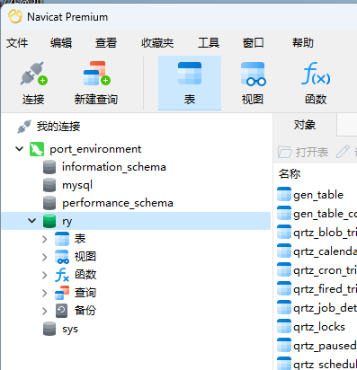

# 港口本底水域生态环境监测管理系统

---
## 项目简介

港口本底水域生态环境监测管理系统是一个用于监控和管理港口本底水域生态环境的应用。该系统结合若依前后端分离版框架，提供了水质监测、生态环境数据分析、环境预警、报告生成等功能，以帮助相关管理人员及时了解港口水域的生态环境状况，进行科学的决策和管理。

本系统采用前后端分离架构，前端使用 Vue.js 进行开发，后端采用 Spring Boot 与 MyBatis 进行开发，使用 MySQL 作为数据库，系统支持 RESTful API 交互，具有高可扩展性和易于维护的特点。

---
## 技术栈

### 前端
- **Vue.js**：前端开发框架，用于构建现代化、响应式的用户界面。
- **Vuex**：前端状态管理工具，用于管理应用的全局状态。
- **Vue Router**：路由管理工具，用于前端页面的切换。
- **Axios**：用于与后端进行数据交互。
- **Element UI**：基于 Vue.js 的组件库，用于构建用户友好的界面。

### 后端
- **Spring Boot**：简化后端开发，提供快速构建 RESTful API 服务的能力。
- **Spring Security**：提供强大的安全框架，用于用户认证和权限控制。
- **MyBatis**：持久层框架，用于高效地与 MySQL 数据库交互。
- **Redis**：用于缓存管理，提升系统性能。

### 数据库
- **MySQL**：关系型数据库，用于存储用户数据和水质监测信息。

### 部署与运行
- **Nginx**：用于前端应用的静态文件部署。
- **Docker**：容器化技术，用于简化应用部署和环境配置。

---
## 系统功能

### 1. 用户管理
- 用户注册与登录：支持用户通过用户名和密码注册与登录。
- 用户信息管理：支持修改个人资料，查看个人历史监测记录等。
- 权限控制：管理员可以分配不同角色的权限，控制访问和操作权限。

### 2. 水质监测
- **实时数据监测**：提供水质监测数据的实时显示，包括温度、pH 值、溶解氧、氨氮等关键指标。
- **历史数据查询**：支持查询指定时间段的水质数据，生成报表并导出。
- **数据展示**：通过图表展示水质监测的趋势和分析结果。

### 3. 环境预警
- **数据异常预警**：根据预设的阈值，系统自动检测数据异常并发送警报。
- **预警记录管理**：查看历史预警记录、报警信息及处理状态。

### 4. 生态环境分析
- **统计与分析**：根据历史数据生成统计报告，帮助分析水域的生态环境趋势。
- **数据可视化**：通过折线图、柱状图等形式直观展示水质变化和生态环境状态。

### 5. 报告生成
- **自动生成报告**：系统根据用户选择的时间范围自动生成环境监测报告。
- **报告导出**：支持将报告导出为 PDF 格式，方便存档和分享。

---
## 项目部署
### 后端
- 参照
https://blog.csdn.net/m0_59381422/article/details/136869494

数据库我的配置是(application-druid.yml)：

            master:
                url: jdbc:mysql://localhost:3306/ry?useUnicode=true&characterEncoding=utf8&zeroDateTimeBehavior=convertToNull&useSSL=false&serverTimezone=Asia/Shanghai
                username: root
                password: 127020qw
            # 从库数据源
            slave:
                # 从数据源开关/默认关闭
                enabled: false
                url: jdbc:mysql://localhost:3306/ry?useUnicode=true&characterEncoding=utf8&zeroDateTimeBehavior=convertToNull&useSSL=false&serverTimezone=Asia/Shanghai
                password: 127020qw

### 前端
- 下载的前端node-v22.15.0-x64.msi
- npm -v
- 10.9.2
- node -v
- v22.15.0

---

- 在cmd中：
- cd /d D:\港口本底水域生态环境监测管理系统\RuoYi-Vue\ruoyi-ui
- npm install --legacy-peer-deps  
- npm run dev

- 下载的前端Redis-x64-3.0.504.msi

### 启动
- 运行RuoYiApplication.java

